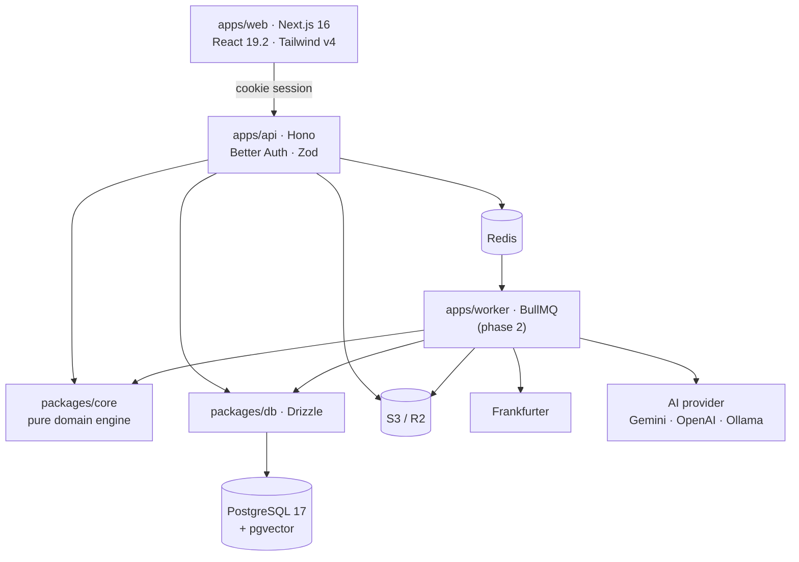
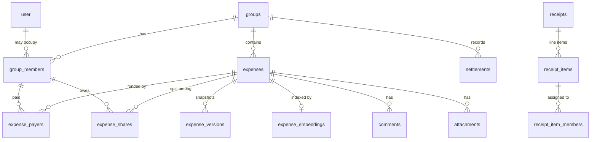

# SplitBills — Implementation Plan

Revision 2 · 2026-07-31 · supersedes the original `SplitBills mock implementation_plan`

---

## 1. What changed from revision 1, and why

The original plan was directionally right. Eleven things in it were wrong,
stale, or over-scoped. Corrections first, because they change what gets built.

### Stale as of July 2026

| Item | Original | Correct | Impact |
| --- | --- | --- | --- |
| Next.js | 15 | **16.2.x** (stable since Oct 2025; 16.2.12 verified building here) | Turbopack is default, Node 20+ floor, `cacheLife`/`cacheTag` stable |
| React | 19 | **19.2** | View Transitions and React Compiler are stable |
| PostgreSQL | 16 | **17** | pgvector images track it; no reason to start a release behind |
| Tailwind | v4 "config" | v4 **CSS-first** | `tailwind.config.js` is gone; tokens live in `@theme` |
| shadcn/ui | assumed | now emits **OKLCH + `tw-animate-css`** | `tailwindcss-animate` is deprecated |

### Wrong on the merits

**Money as `integer`.** Revision 1 said "all monetary amounts stored as
`integer` (minor units)". A 32-bit integer caps at ~$21.5M in cents, and JS
`number` loses exactness above 2^53. It is **`bigint`**, in the database and in
TypeScript. → [ADR 0001](adr/0001-money-as-bigint-minor-units.md)

**Currency exponents.** Revision 1 never mentioned them. JPY has 0 decimal
places and KWD has 3. Any code dividing by a hardcoded `100` misprices every
expense in those currencies. There is now an exponent table and an
`exponentOf()` accessor, and nothing divides by a literal.

**"Backtracking with pruning for optimal minimum" on ≤15 people.** Debt
simplification is NP-hard. This would work but is unnecessary machinery for a
problem where greedy is already within one transfer of optimal in practice, and
where the property users actually depend on is *balance preservation*, not
minimality. → [ADR 0005](adr/0005-debt-simplification-greedy.md)

**Expenses referencing `users`.** Revision 1's ER diagram had
`users ||--o{ expense_shares`. That makes it impossible to split with someone
who has not signed up — one of the most-used features in this category. Expenses
reference `group_members`, whose `user_id` is nullable.
→ [ADR 0004](adr/0004-expenses-reference-group-members.md)

**A four-stage OCR pipeline.** Image → preprocess → OCR → LLM → extract →
merchant → category was correct in 2023. In 2026 a vision model takes the image
and returns structured JSON in one call. The pipeline collapses to one request
with a response schema.

**No idempotency.** Revision 1 promised offline support with no idempotency
keys. An offline client replaying a queued request creates duplicate expenses.
`idempotencyKey` is on `expenses` and `settlements`, with partial unique indexes
enforcing it.

### Over-scoped

**~190 files, ~45 tables in "Phase 1, this session".** Most of it would be
unverifiable stubs. Phase 1 is now a **vertical slice that runs and is tested**,
plus schema for the planned features so later work is handlers rather than
migrations.

**`packages/types` and `packages/ui` on day one.** A shared package with one
consumer is indirection with no payoff. Types live with the code that owns them;
Drizzle infers row types and Zod infers request types. `packages/ui` gets created
when a second app needs a component — not before.

**GraphQL + REST + three SDKs in the roadmap's foundations.** Hono's RPC client
gives the web app end-to-end type safety with no codegen and no second API
surface. GraphQL earns its place when an external consumer asks for it.

### Added, because they matter more than several planned features

- **Splitwise CSV/API importer.** The single largest barrier to switching. Cheap
  to build, and every competitor that gained traction has one.
- **Per-group "simplify debts" toggle.** The optimised plan can route a payment
  between two people who never transacted, which surprises people.
- **Placeholder members.** Split with someone before they have an account.
- **Expense versioning + restore.** Snapshot before every edit and delete.
- **Payment deep links** (UPI / PayPal / Wise) and QR settle-up. SplitBills
  records that money moved; it never moves money. Staying out of the payments
  business is what keeps it self-hostable and unregulated.

---

## 2. Current state — what is built and verified

Everything below runs. Verification output is in §7.

```
packages/core   Money, splits, balances, debt simplification. Pure, no I/O.
                30 tests, node --test, no framework, ~1s.
packages/db     Drizzle schema — 24 tables incl. pgvector embeddings. Typechecks.
apps/api        Hono + Better Auth. Groups, members, expenses, balances,
                settlements. requireMembership on every group route. Typechecks.
apps/web        Next.js 16 + Tailwind v4. Landing, auth, groups, group detail
                with balances and settle-up. Builds, 5 routes.
```

**The vertical slice:** sign up → create group → add members (real or
placeholder) → record an expense → see balances → settle up.

All five split methods, multiple payers, multi-currency, idempotency, soft
deletes, and version snapshots are implemented in the engine and the API. The
web UI currently exposes equal-split only; the other four use the same endpoint.

---

## 3. Architecture



`packages/core` has no I/O, no database, and no framework. That is what makes
the money invariants testable in a second, and it is the reason the test suite
needs no Docker.

### Request path for a write

```
POST /api/groups/:id/expenses
  → withSession          resolve Better Auth session
  → requireAuth          401 if anonymous
  → zValidator           shape + types
  → requireMembership    row-level gate — 404 if not a member
  → assertMembersInGroup no naming members of other groups
  → parseAmount          decimal string → bigint, currency-aware
  → assertPayersCoverTotal
  → computeSplit         server recomputes; client amounts never trusted
  → db.transaction       expense + payers + shares + activity, atomically
```

---

## 4. Data model

24 tables. Full schema in `packages/db/src/schema.ts`.



Groups: `groups`, `group_members`, `group_invitations`, `friendships`
Expenses: `expenses`, `expense_payers`, `expense_shares`, `expense_versions`,
`recurring_expenses`, `categories`
Money: `settlements`, `exchange_rates`
Content: `attachments`, `receipts`, `receipt_items`, `receipt_item_members`,
`comments`
System: `activity_log`, `notifications`, `audit_logs`
AI: `expense_embeddings` (pgvector 768, HNSW cosine), `ai_chat_messages`,
`merchant_cache`
Auth: `user`, `session`, `account`, `verification` (Better Auth)

Conventions: `bigint` for money, `char(3)` for currency, `numeric(20,10)` for
rates, `deletedAt` soft deletes everywhere, partial unique indexes for
idempotency keys.

---

## 5. Roadmap

### Phase 2 — Complete the product (next)

| Item | Notes |
| --- | --- |
| Expense edit + version restore | Snapshot table already exists |
| Remaining split methods in UI | Endpoint already supports all five |
| Group invitations | Token links + claiming a placeholder seat |
| Friends and 1:1 groups | A DM is a group of two; no new balance code |
| Categories + notes + comments + attachments | Tables exist |
| Recurring expenses | BullMQ repeatable job over `recurring_expenses` |
| FX sync worker | Frankfurter → `exchange_rates`, every 6h |
| **Splitwise importer** | CSV + API; dedupe on amount/date/description |
| Activity feed | Cursor-paginated over `activity_log` |
| Email notifications | Resend, SMTP fallback |
| OpenAPI 3.1 + Scalar docs | `@hono/zod-openapi` over existing Zod schemas |
| `apps/worker` | BullMQ consumers |

### Phase 3 — AI

| Item | Notes |
| --- | --- |
| Receipt capture → expense | One vision call returning structured JSON |
| Item-level assignment | "Who ordered the burger" — tables exist |
| Proportional tax/tip | Allocated across assigned items via `allocate` |
| Auto-categorisation + merchant detection | Cached in `merchant_cache` |
| Duplicate detection | Cosine similarity over `expense_embeddings` |
| AI chat over expenses | RAG; answers cite expense ids |
| Voice entry | Web Speech API → same structured extraction |
| Trip summary | Generated report at group close |
| Budget advisor / anomaly alerts | Compare against rolling category medians |

### Phase 4 — Analytics, export, real-time

Spending charts, GitHub-style heatmap, calendar view, CSV/Excel/JSON/PDF export,
GDPR delete. Real-time via **Postgres `LISTEN`/`NOTIFY` → SSE** — a broadcast
channel, not bidirectional editing, so WebSockets buy nothing.

Offline: TanStack Query persistence + a mutation queue keyed by
`idempotencyKey`. This covers the realistic cases (record an expense on a plane)
without adopting a sync engine. A real sync engine — PowerSync is the most
production-ready in 2026 — only if usage shows the queue is insufficient. CRDTs
are for collaborative text, not for rows, and are out of scope.

### Phase 5 — Platform

Webhooks, TypeScript SDK, Python SDK, PWA install, 2FA and passkeys (Better Auth
plugins), Discord/Slack notifications, GraphQL if an external consumer asks.

---

## 6. Security

Enforced today:

- **`requireMembership` on every group route** — the only row-level gate. Returns
  404, not 403, so group ids cannot be probed.
- **`assertMembersInGroup` on every write accepting member ids** — otherwise a
  caller could name a member of a group they cannot read.
- Server recomputes all splits; client amounts are never trusted.
- Zod validation at every boundary, `.strict()` on write bodies.
- `secureHeaders`, CORS pinned to `WEB_ORIGIN`, CSRF origin check.
- Session cookies via Better Auth; no tokens in `localStorage`.
- Env validated by Zod at boot — the process refuses to start misconfigured.
- Internal error messages never reach clients; unknown errors log and return 500.
- Soft deletes; `audit_logs` is append-only.

Planned: rate limiting (Redis), signed URLs for attachments, encryption at rest
for receipts, 2FA/passkeys, GDPR export and delete.

---

## 7. Verification

Run: `pnpm check`

```
packages/core   tsc --noEmit          OK
                node --test           30/30 pass
packages/db     tsc --noEmit          OK
                drizzle-kit generate  OK — 24 tables
apps/api        tsc --noEmit          OK
apps/web        tsc --noEmit          OK
                next build            OK — 5 routes, Next.js 16.2.12
```

CI additionally applies the schema to a real PostgreSQL 17 + pgvector service
on every push, which is what proves the HNSW index and its operator class are
valid rather than merely well-typed. Both jobs green on the initial commit.

The core suite brute-forces the split invariant across all totals from −50 to
+50 for 1–7 participants, and asserts end-to-end that a four-expense trip with
mixed split methods settles to exactly zero after applying the generated
transfers.

**Not yet verified:** no test exercises the HTTP layer against a live database,
so `requireMembership`, the transactional writes, and idempotent replay are
reviewed but not proven. Closing that is the first task of phase 2 — a seeded
database plus a request-level pass over the API. Treat the authorization gates
as unproven until it exists.

---

## 8. Deployment

Local: `docker compose up -d` gives Postgres 17 + pgvector, Redis, MinIO, and
Frankfurter. No third-party account is needed to run the whole product.

Hosted: web on Vercel, API on Railway/Fly.io/Render, Postgres on Neon, Redis on
Upstash, storage on Cloudflare R2, email via Resend. Every one is swappable by
environment variable, and none is required.
