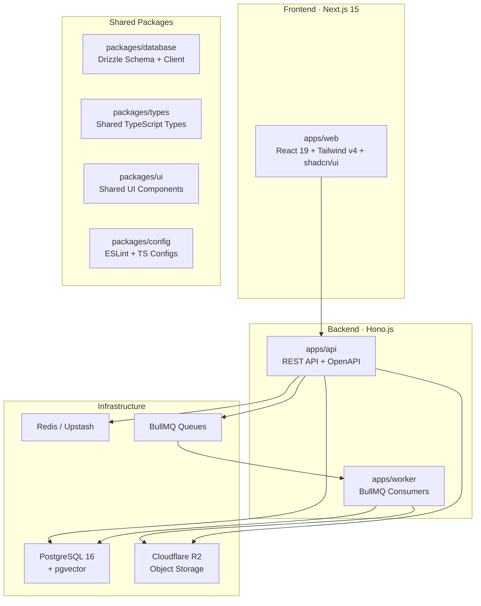
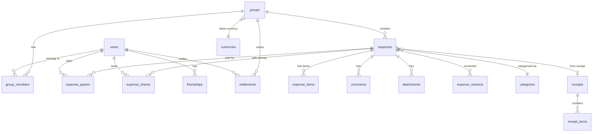

# Split Bills — Open-Source Collaborative Finance Platform

An open-source, next-generation expense collaboration platform that goes beyond bill splitting with AI, automation, real-time collaboration, and self-hostability.

## Background & Vision

Split Bills combines the best of **Splitwise + Notion + Monzo Shared Tabs + Google Photos OCR + ChatGPT + YNAB analytics** into a single, self-hostable platform. Rather than cloning Splitwise, we're building a fundamentally better architecture with AI-first features, event-driven design, and a premium developer experience.

---

## Research-Backed Tech Stack Decisions

After thorough research of the 2026 ecosystem, here are the optimal choices for each layer:

### Backend: **Hono.js** over NestJS

| Factor | Hono.js ✅ | NestJS |
|--------|-----------|--------|
| **Performance** | Ultra-fast, near-zero cold starts (<5ms) | 500–2000ms cold starts |
| **Bundle size** | ~14KB | ~50MB+ |
| **Runtime** | Multi-runtime (Edge, Bun, Deno, Node) | Node.js only |
| **TypeScript** | Types-first, no decorators/reflection | Decorator-heavy, reflection |
| **Deployment** | Edge-native (Vercel, Cloudflare, Railway) | Needs long-running process |
| **DX** | Clean, minimal boilerplate | Heavy framework ceremony |

> **Rationale**: For a solo/small-team open-source project that needs to be self-hostable AND edge-deployable, Hono's minimalism wins. We'll enforce clean architecture ourselves with a modular structure using middleware and DI patterns.

### ORM: **Drizzle ORM** over Prisma

| Factor | Drizzle ✅ | Prisma |
|--------|-----------|--------|
| **Bundle size** | ~7.4KB | ~1.6MB |
| **Cold starts** | 50-100ms | 80-150ms |
| **pgvector** | **Native support** (vector type, HNSW indexes) | `Unsupported()` hack + raw SQL |
| **SQL control** | SQL-first, transparent queries | Abstraction-first |
| **Schema** | TypeScript-native, no codegen step | Requires `prisma generate` |
| **Type safety** | Real-time inference | Precomputed (code-gen) |

> **Rationale**: Drizzle's native pgvector support is critical for our AI/semantic search features. Its SQL-first approach gives us precise control over financial queries where floating-point precision matters.

### Auth: **Better Auth** over Auth.js v5

| Factor | Better Auth ✅ | Auth.js v5 |
|--------|--------------|-----------|
| **2FA** | Built-in plugin | Manual implementation |
| **RBAC** | Built-in plugin | Manual implementation |
| **Organizations** | Built-in multi-tenancy | Not included |
| **Passkeys** | Built-in plugin | Limited |
| **Self-hosted** | Yes, own your data | Yes |
| **DX** | Modern, TypeScript-first, Vercel-backed | Mature but more complex |
| **Hono integration** | First-class adapter | Needs custom adapter |

> **Rationale**: Better Auth is the 2026 breakout choice. Built-in 2FA, RBAC, organizations (groups!), passkeys, and first-class Hono adapter. Lucia is deprecated. Auth.js v5 lacks built-in features we need.

### State Management (Frontend)

| State Type | Tool | Why |
|-----------|------|-----|
| **Server data** | **TanStack Query** | Auto caching, retries, optimistic updates |
| **Global UI** | **Zustand** | Minimal boilerplate, no providers |
| **Forms** | **React Hook Form + Zod** | Performance, validation |
| **URL state** | **nuqs** | Shareable, persistent filters |

### AI/OCR: **Provider-Agnostic** with Pluggable Adapters

| Use Case | Default | Alternatives |
|----------|---------|-------------|
| **Receipt OCR** | Google Vision API | Tesseract (self-hosted), Mistral OCR |
| **AI Chat / Categorization** | Google Gemini | OpenAI, Anthropic, Ollama (local) |
| **Embeddings** | Google text-embedding | OpenAI ada-002, local models |

> **Rationale**: Build a provider interface (`AIProvider`) that users can swap via env vars. Default to Google Gemini (free tier), but support OpenAI and local/Ollama for self-hosters.

### Email: **Resend** (default) with SMTP fallback

> Best DX in 2026, React Email components. Falls back to any SMTP for self-hosters.

### Full Stack Summary

```
┌─────────────────────────────────────────────────┐
│                   FRONTEND                       │
│  Next.js 15 · React 19 · TypeScript             │
│  Tailwind CSS v4 · shadcn/ui · Framer Motion    │
│  TanStack Query · Zustand · React Hook Form     │
│  nuqs · recharts                                │
├─────────────────────────────────────────────────┤
│                   AUTH LAYER                      │
│  Better Auth (Google, GitHub, Email, Magic Link) │
│  2FA · RBAC · Organizations · Passkeys          │
├─────────────────────────────────────────────────┤
│                   BACKEND API                    │
│  Hono.js (multi-runtime, edge-ready)            │
│  Zod validation · OpenAPI auto-gen              │
│  Modular architecture · Middleware DI           │
├─────────────────────────────────────────────────┤
│                   DATA LAYER                     │
│  Drizzle ORM · PostgreSQL 16 + pgvector         │
│  Native vector search · HNSW indexes            │
│  Materialized views · Financial precision       │
├─────────────────────────────────────────────────┤
│               BACKGROUND JOBS                    │
│  BullMQ · Redis (Upstash compatible)            │
│  OCR · Notifications · FX sync · Recurring      │
├─────────────────────────────────────────────────┤
│               INFRASTRUCTURE                     │
│  Docker Compose (dev) · Vercel (frontend)       │
│  Railway/Fly.io (API) · Neon (PostgreSQL)       │
│  Upstash (Redis) · Cloudflare R2 (storage)      │
│  Resend (email) · Sentry (errors)               │
└─────────────────────────────────────────────────┘
```

---

## Architecture Overview



---

## Proposed Changes

### Phase 1: Foundation (This Session)

Everything needed for a functional, deployable expense-splitting platform.

---

### 1. Monorepo Scaffold

#### [NEW] Root Configuration Files

| File | Purpose |
|------|---------|
| `package.json` | Root workspace scripts, devDependencies |
| `pnpm-workspace.yaml` | Workspace definition (`apps/*`, `packages/*`) |
| `turbo.json` | Turborepo pipeline (build, dev, lint, test, db:generate, db:push) |
| `.gitignore` | Node, Next.js, Drizzle, env exclusions |
| `.env.example` | Template for all environment variables |
| `.nvmrc` | Node 22 version pin |
| `docker-compose.yml` | PostgreSQL 16 + pgvector, Redis, MinIO (R2 local) |
| `Dockerfile` | Multi-stage build for API + Worker |
| `README.md` | Project overview, setup, architecture diagram |
| `LICENSE` | MIT License |
| `CONTRIBUTING.md` | Contribution guidelines |

---

### 2. Shared Packages

#### [NEW] `packages/database/` — Drizzle Schema & Client

The database is the heart of Split Bills. ~45 tables covering all domains:

**Core Domain Tables:**
```
── Auth & Users ──
users                  - Core user accounts
accounts               - OAuth provider accounts (Better Auth)
sessions               - Active sessions (Better Auth)
verifications          - Email/phone verification tokens
profiles               - Extended user profiles
user_preferences       - App settings per user

── Social ──
friendships            - Bidirectional friend relationships
friend_requests        - Pending friend requests

── Groups ──
groups                 - Groups/organizations
group_members          - Membership with roles (OWNER, ADMIN, MEMBER)
group_invitations      - Shareable invite links + email invites

── Expenses (Core Engine) ──
expenses               - Main expense records
expense_items          - Line items (for itemized splits)
expense_payers         - Who paid (supports multiple payers)
expense_shares         - Who owes what (EQUAL, EXACT, PERCENTAGE, SHARES)
expense_versions       - Version history (v1, v2, v3...)

── Settlements ──
settlements            - Settlement/payment records
settlement_items       - Individual settlement line items

── Financial ──
currencies             - Supported currencies (ISO 4217)
exchange_rates         - Historical FX rates (snapshotted)
recurring_expenses     - Automated recurring expense definitions

── Organization ──
categories             - Expense categories (hierarchical)
comments               - Threaded comments on expenses
attachments            - File attachments (receipts, PDFs)
receipts               - OCR receipt metadata
receipt_items          - Parsed receipt line items

── Communication ──
notifications          - In-app notifications
activity_log           - Activity feed events

── AI & Search ──
embeddings             - pgvector embeddings for semantic search
ai_chat_messages       - AI chat history
merchant_cache         - Known merchant detection cache

── System ──
audit_logs             - Complete audit trail (event sourcing)
```

**Key Design Decisions:**
- All monetary amounts stored as `integer` (minor units / cents) — **no floating point ever**
- Exchange rates stored as `numeric(20,10)` for precision
- Every expense snapshots the FX rate at creation time — never recompute
- Balances are **derived** from immutable expense + settlement events (no stored balances)
- Soft deletes via `deletedAt` timestamps across all entities
- Full audit trail via `audit_logs` with JSON diff snapshots
- `expense_shares` supports all split types via discriminated union: `EQUAL`, `EXACT`, `PERCENTAGE`, `SHARES`, `ADJUSTMENT`
- pgvector `vector(1536)` column on embeddings table with HNSW index

**ER Diagram (Core):**


#### [NEW] `packages/types/` — Shared TypeScript Types

- API request/response DTOs (Zod schemas → inferred types)
- Domain enums (`SplitType`, `GroupType`, `GroupRole`, `ExpenseStatus`, `NotificationType`)
- Event types for the event bus (`ExpenseCreated`, `SettlementRecorded`, etc.)
- Utility types and constants (currency codes, category icons)

#### [NEW] `packages/ui/` — Shared UI Component Library

- Re-exported shadcn/ui components with custom theme
- Design tokens (colors, typography, spacing)
- Shared Tailwind v4 theme configuration

#### [NEW] `packages/config/` — Shared Configuration

- `tsconfig.base.json` — Strict TypeScript base
- `eslint.config.mjs` — ESLint flat config
- Shared Prettier config

---

### 3. Backend API (`apps/api/`)

#### [NEW] Hono.js Application

**Modular Structure:**
```
src/
├── index.ts                    # Entry point, Hono app setup
├── app.ts                      # Route composition
├── lib/
│   ├── auth.ts                 # Better Auth instance
│   ├── db.ts                   # Drizzle client
│   ├── redis.ts                # Redis/Upstash client
│   ├── queue.ts                # BullMQ queue producers
│   ├── storage.ts              # R2/S3 client
│   ├── env.ts                  # Zod-validated env vars
│   └── errors.ts               # Custom error classes
├── middleware/
│   ├── auth.middleware.ts       # JWT verification, session
│   ├── rate-limit.middleware.ts # Rate limiting
│   ├── cors.middleware.ts       # CORS configuration
│   ├── logger.middleware.ts     # Request logging
│   └── error-handler.ts        # Global error handler
├── routes/
│   ├── auth.routes.ts           # Better Auth mount
│   ├── users.routes.ts          # User CRUD, preferences
│   ├── friends.routes.ts        # Friend requests, friendships
│   ├── groups.routes.ts         # Group CRUD, memberships, invites
│   ├── expenses.routes.ts       # Expense CRUD, split calculations
│   ├── settlements.routes.ts    # Settlement recording, debt simplification
│   ├── categories.routes.ts     # Expense categories
│   ├── currencies.routes.ts     # Currency management, FX rates
│   ├── notifications.routes.ts  # Notification management
│   ├── comments.routes.ts       # Expense comments
│   ├── attachments.routes.ts    # File uploads
│   ├── activity.routes.ts       # Activity feed
│   ├── recurring.routes.ts      # Recurring expenses
│   └── health.routes.ts         # Health checks
├── services/
│   ├── expense.service.ts       # Expense business logic
│   ├── settlement.service.ts    # Settlement + debt simplification
│   ├── balance.service.ts       # Balance computation engine
│   ├── group.service.ts         # Group management
│   ├── friend.service.ts        # Friendship management
│   ├── notification.service.ts  # Notification dispatch
│   ├── currency.service.ts      # FX rate fetching & caching
│   ├── activity.service.ts      # Activity feed
│   └── split-calculator.ts     # Split calculation engine (all types)
├── validators/
│   └── *.schema.ts              # Zod validation schemas per route
└── utils/
    ├── debt-simplifier.ts       # Graph-based debt optimization
    ├── money.ts                 # Money arithmetic helpers
    └── pagination.ts            # Cursor-based pagination
```

**Key API Endpoints (REST):**

| Module | Endpoints |
|--------|-----------|
| Auth | `POST /api/auth/*` (Better Auth handles all routes) |
| Users | `GET /api/users/me`, `PATCH /api/users/me`, `GET /api/users/:id` |
| Friends | `GET /api/friends`, `POST /api/friends/request`, `PATCH /api/friends/:id/accept`, `DELETE /api/friends/:id` |
| Groups | `CRUD /api/groups`, `POST /api/groups/:id/invite`, `POST /api/groups/:id/join`, `GET /api/groups/:id/balances` |
| Expenses | `CRUD /api/expenses`, `GET /api/groups/:id/expenses`, `POST /api/expenses/:id/duplicate` |
| Settlements | `POST /api/settlements`, `GET /api/settlements`, `POST /api/groups/:id/simplify-debts` |
| Categories | `GET /api/categories` |
| Currencies | `GET /api/currencies`, `GET /api/currencies/rates` |
| Activity | `GET /api/activity` (paginated feed) |
| Notifications | `GET /api/notifications`, `PATCH /api/notifications/:id/read` |

**Debt Simplification Algorithm:**
```
1. Compute net balances per user per currency within group
2. Separate into debtors (negative balance) and creditors (positive balance)
3. For groups ≤ 15 people: backtracking with pruning for optimal minimum
4. For groups > 15 people: greedy matching (largest debtor ↔ largest creditor)
5. Create settlement suggestions for min(|debit|, credit) each iteration
6. Return optimized settlement plan
```

---

### 4. Background Worker (`apps/worker/`)

#### [NEW] BullMQ Worker Application

**Queues & Processors:**
| Queue | Purpose | Schedule |
|-------|---------|----------|
| `notifications` | Email + push notification dispatch | On event |
| `currency-sync` | Fetch latest FX rates from API | Every 6 hours |
| `recurring-expenses` | Auto-create recurring expenses | Every hour |
| `activity-log` | Async activity feed writes | On event |
| `cleanup` | Soft-delete cleanup, session pruning | Daily |

---

### 5. Frontend (`apps/web/`)

#### [NEW] Next.js 15 Application

**App Router Structure:**
```
app/
├── (auth)/
│   ├── login/page.tsx
│   ├── register/page.tsx
│   └── layout.tsx              # Minimal auth layout
├── (dashboard)/
│   ├── layout.tsx              # Sidebar + topbar + notifications
│   ├── page.tsx                # Dashboard (recent activity, balances, quick actions)
│   ├── groups/
│   │   ├── page.tsx            # All groups grid
│   │   ├── new/page.tsx        # Create group wizard
│   │   └── [id]/
│   │       ├── page.tsx        # Group detail + expense list
│   │       ├── balances/page.tsx  # Group balances + settle up
│   │       ├── settings/page.tsx  # Group settings + members
│   │       └── expenses/
│   │           └── new/page.tsx   # Multi-step expense creation
│   ├── friends/
│   │   └── page.tsx            # Friends list + requests
│   ├── activity/
│   │   └── page.tsx            # Activity feed timeline
│   ├── expenses/
│   │   └── page.tsx            # All expenses (searchable)
│   └── settings/
│       └── page.tsx            # User settings + preferences
├── api/                        # Next.js API routes (auth callbacks only)
├── layout.tsx                  # Root layout + providers
└── globals.css                 # Tailwind v4 theme + design tokens
```

**Design System (Premium Dark-First):**
- **Color palette**: Deep navy (#0A0E1A) base, violet/indigo gradients (#7C3AED → #4F46E5), teal accents (#14B8A6)
- **Typography**: Inter (body), JetBrains Mono (numbers/currency)
- **Effects**: Glassmorphism cards (backdrop-blur-xl), gradient borders, glow effects
- **Animations**: Framer Motion on all transitions, spring physics, stagger reveals
- **Components**: shadcn/ui with custom dark theme override
- **Responsive**: Mobile-first breakpoints, bottom nav on mobile
- **PWA**: Web manifest + service worker stub

**Key Frontend Features:**
- TanStack Query for all server state (expenses, groups, balances)
- Zustand for UI state (sidebar, modals, theme)
- React Hook Form + Zod for all forms (validated end-to-end)
- nuqs for URL-based filters/search
- Optimistic updates on expense CRUD
- Infinite scroll for activity feed
- Animated balance donut charts (recharts)
- Multi-step expense creation wizard with split preview
- Group invitation flow with shareable links
- Real-time notification badge
- Currency selector with flag emojis

---

### 6. Docker & DevOps

#### [NEW] `docker-compose.yml`
```yaml
services:
  postgres:
    image: pgvector/pgvector:pg16    # PostgreSQL 16 + pgvector
  redis:
    image: redis:7-alpine
  minio:
    image: minio/minio               # S3-compatible local storage
```

#### [NEW] `.github/workflows/ci.yml`
- Lint (ESLint) + Type-check + Test on all PRs
- Build verification for all apps
- Drizzle schema validation

---

## Phases 2–5 (Future Roadmap)

### Phase 2: AI & Advanced Features
- Receipt OCR pipeline (Google Vision / Tesseract / Mistral — pluggable)
- AI Chat over expenses (pgvector RAG)
- Voice expense entry (Web Speech API)
- AI auto-categorization & merchant detection
- Duplicate receipt detection (vector similarity)

### Phase 3: Analytics & Export
- Spending charts (category breakdown, trends)
- GitHub-style expense heatmaps
- AI trip summary generator
- Budget advisor alerts
- CSV / Excel / JSON / PDF export
- Calendar view

### Phase 4: Real-time & Collaboration
- SSE-based live updates (balance changes, new expenses)
- WebSocket for collaborative expense editing (CRDT)
- Web Push notifications
- Discord / Slack webhook integrations
- Service worker offline support

### Phase 5: Platform & API
- OpenAPI 3.1 auto-generated docs (Hono's built-in support)
- Webhook delivery system
- TypeScript SDK (npm package)
- Python SDK
- GraphQL API layer
- Full PWA with install prompt

---

## GitHub Repository

- **Owner**: `aaron-seq`
- **Repo**: `split-bills`
- **Visibility**: Public
- **License**: MIT
- **Description**: "Open-source collaborative finance platform — expense splitting, debt simplification, AI receipt parsing, and more."

---

## Verification Plan

### Automated
```bash
pnpm turbo lint          # ESLint across all packages
pnpm turbo type-check    # TypeScript strict compilation
pnpm turbo build         # Production builds of all apps
```

### Manual
- `docker compose up -d` starts PostgreSQL + Redis + MinIO
- `pnpm db:push` creates all ~45 database tables
- `pnpm dev` starts API (port 3001) + Web (port 3000) + Worker
- Frontend loads at `http://localhost:3000` with login page
- API health check at `http://localhost:3001/api/health`
- GitHub repo is public at `github.com/aaron-seq/split-bills`

---

## File Count Estimate (Phase 1)

| Area | Files |
|------|-------|
| Root config | ~18 |
| packages/database | ~12 |
| packages/types | ~15 |
| packages/config | ~6 |
| packages/ui | ~8 |
| apps/api (Hono) | ~50 |
| apps/worker | ~12 |
| apps/web (Next.js) | ~65 |
| Docker/CI | ~5 |
| **Total** | **~190 files** |

Shall I proceed with building this?
